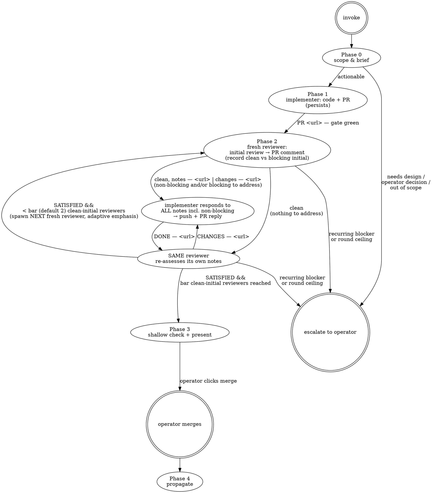

# Dev Cycle

## Overview

Take any coherent unit of development — feature, bug, refactor, infra, docs — from a brief to an approved PR, using a **persistent implementer** and a **fresh adversarial reviewer per round**, sequenced by **you, the context-rich session that invoked this skill**.

This is a deliberate **redesign of `issue-pr-cycle`**: same trustworthiness, far less ceremony. There is **no manager**. Its functions redistribute — brief-authoring to you, arbitration to direct implementer↔reviewer **PR comments**, convergence to the review bar's clean-initial reviewer rounds (default two, tunable by work-type), merge to the operator.

**Defining assumption (why it can be lighter):** you are already context-rich. You leverage accumulated understanding to write a tight brief rather than re-deriving the project cold (which is what `issue-pr-cycle`'s manager Phase-0 spent effort on). If you are NOT yet context-rich about this work — you've just been handed a cold issue and a fresh session — **build that context first** (read the issue, the relevant code, memory, and any `knowledge/*.md`), then run the cycle. dev-cycle is the workflow for everything while it is trialed; do not fall back to issue-pr-cycle.

**The "you" throughout this skill is the orchestrator** — the invoking session. You author the brief once, spawn agents, and sequence turns on one-line verdicts. You hold the only `Agent` / `SendMessage` access; the implementer and reviewer cannot spawn or message anyone (see "Coordination" below).

## How this differs from `issue-pr-cycle` (the harness it replaces)

| Aspect | `dev-cycle` | `issue-pr-cycle` (predecessor) |
|---|---|---|
| Orchestration | the invoking context-rich session, directly | a dedicated manager agent that cold-interrogates the issue(s) first |
| Reviewer | fresh per round — a brand-new adversary each round | one persistent reviewer across rounds |
| Ceremony | one brief, one-line verdicts, PR comments as the record | six-criterion TaskList, manager arbitration + manager final review |
| Agents | implementer + reviewer, both Opus | manager (opus) + implementer + reviewer (sonnet) |
| Scope | one coherent unit, usually one PR (multi-PR = sequential runs) | multi-PR stacking under one owning manager; the wave sub-skills drive its manager interface |

`dev-cycle` is intended to **replace** `issue-pr-cycle` (and likely the under-used wave/wrapper skills) once proven. **While it is being trialed, use dev-cycle for all work — do not route anything to issue-pr-cycle**, even cold-start work (build context first, then run the cycle). The two coexist only so issue-pr-cycle isn't deleted preemptively; do not modify it when working in `dev-cycle`.

## Roles (four)

| Role | Who | Lifetime | Job |
|---|---|---|---|
| **Orchestrator** | you, the invoking context-rich session | whole cycle, near-weightless | author the brief once, then sequence turns on one-line verdicts |
| **Implementer** | one `Agent` (Opus) | persistent across all rounds (via `SendMessage`) | all code/test/doc changes; opens & updates the PR |
| **Reviewer** | a fresh `Agent` per round (Opus) | one round — persistent *within* the round (re-engaged via `SendMessage` to re-assess its own notes), fresh `Agent` *across* rounds | adversarial initial review; posts findings to the PR; re-assesses how the implementer handled them until satisfied; returns `SATISFIED` / `CHANGES`; ends |
| **Operator** | the human | — | merges (the checkpoint) |

Both spawned roles are **Opus** — no sonnet tiering. The implementer is spawned once and resumed; each reviewer is a fresh spawn that **persists across its own round** (you re-engage it to re-assess its notes) and ends once it returns `SATISFIED`.

## The loop



### Phase 0 — Scope & brief *(you, using your context)*

- **Lightweight triage.** Sort the work into one of: **actionable** (clear enough to brief) / needs **light design first** / needs an **operator decision** / **out of scope**. This is NOT a full cold interrogation — the question is just "can I write a clear brief?" If yes, proceed. If it needs design or an operator call, do that or escalate before spawning anyone.
- **Author the kickoff brief** (anatomy below).
- **Pick the review bar** (used at Phase 3 convergence): **two** clean initials by default; **one** only for low-risk *mechanical* work whose correctness the compiler/test-suite proves on its own (a pure rename, a dependency/scope rename, a doc-only change). Your call from the work-type — see Phase 3.
- **Ensure the shared worktree exists** under `.claude/worktrees/` (per CLAUDE.md), and the **GitHub issue exists** (file one if the work started from a description, so the PR has a `Closes #N` target and the plan has a home — specs live on issues, not in committed plan files).

### Phase 1 — Implement *(persistent implementer)*

- Spawn the implementer (template below) with the brief, pointed at the shared worktree.
- It works **TDD-first**, runs the **pre-push gate** (`bun run test && bun tsc --noEmit && bun run lint` — all three must exit 0), opens the PR on a `claude/`-prefixed branch targeting `main`, and returns a terse signal: `PR <url> — gate green`.
- It **stays alive** for the rest of the cycle. Resume it with `SendMessage` — never a second `Agent` spawn (that loses its context).

### Phase 2 — Review rounds *(loop)*

Each round is one **fresh reviewer** that is **persistent within the round**. The reviewer does an initial review, then goes back-and-forth with the implementer until *that reviewer* is satisfied; only then does the next round get a brand-new reviewer.

- **Initial review → a THREE-way verdict.** Spawn a **fresh reviewer** (template below), pointed at the worktree + PR. It reviews with fresh eyes, posts findings (blocking AND non-blocking) as a **single PR comment**, and returns exactly one of:
  - `VERDICT: clean` — zero blocking AND zero non-blocking notes; literally nothing to address.
  - `VERDICT: clean, notes — <comment-url>` — zero blocking, but it left non-blocking notes that still owe an implementer response.
  - `VERDICT: changes — <comment-url>` — one or more blocking problems.

  The middle token is the load-bearing fix for a recurring orchestrator slip: a bare `clean` used to hide non-blocking notes in a comment you never opened, so you'd skip the implementer's response to them and present. Now the **token itself** carries the obligation — you dispatch on the token, never on a comment you have to remember to read: `clean` → the reviewer is immediately `SATISFIED`, no exchange; `clean, notes` or `changes` → the implementer responds (next bullet). **Record whether this reviewer's INITIAL verdict had zero blocking** (`clean` or `clean, notes`) — that, not its final state, is what convergence counts (Phase 3); a `clean, notes` initial is still a clean initial.
- **Implementer responds to everything.** On `clean, notes` or `changes`, `SendMessage` the implementer: "respond to the review at `<comment-url>` — address every concern, blocking AND non-blocking (code + PR reply), push, return `DONE — <url>`." The implementer reads the comment directly off the PR and addresses **all** notes in this same PR; the only out is a justified deferral posted as a PR reply (genuinely not worth doing, or a separate issue it then files) — never a silent skip. It returns `DONE — <url>`.
- **Same reviewer re-assesses.** `SendMessage` the **SAME** reviewer (not a fresh one): "the implementer responded — re-assess how your notes were handled and return `SATISFIED` or `CHANGES — <comment-url>`." `CHANGES` → loop back to the implementer (same implementer, same reviewer; anything new the reviewer notices at re-assessment, even a fresh non-blocking note, also rides `CHANGES`). `SATISFIED` → this reviewer's round ends. (A `clean` initial needs no exchange — the reviewer is immediately `SATISFIED`.) **Every reviewer has the last say in its own cycle — this applies to `clean, notes` exactly as to `changes`.** A non-blocking note still owes the SAME reviewer's `SATISFIED`; you do NOT substitute your own shallow check (gate-green + diff scoped) for the reviewer's re-assessment, and you do NOT skip the re-assessment because the fix "looks trivial." In particular, when the implementer's response adds or changes a TEST, the *reviewer* revert-proofs that test (neutralize the production guard → confirm the new test fails) — a shallow diff/gate check structurally cannot tell a genuine revert-proof from a theater test that passes both ways.
- **Next round — adaptive-calibrated diversity.** When a reviewer returns `SATISFIED`, spawn the **next fresh reviewer** (a new `Agent`, not the prior one) — UNLESS convergence is reached (Phase 3). Each **follow-up** reviewer (the 2nd onward) is told to **read the prior reviews in the thread to see which dimensions they emphasized, and aim its EXTRA scrutiny at the least-covered ones** (resource/lifecycle, concurrency/races, adversarial/security, reachability, failure/error-path injection) — while STILL independently re-running the full load-bearing DNA, so the core stays double-confirmed. This trades a little independence for coverage diversity, which matters because convergence caps you at ~2 reviews: two *same-angle* independent passes re-confirm the same surface and leave orthogonal failure modes (e.g. a resource leak invisible to every behavioral assertion) to luck; aiming the second reviewer at the first's blind spots makes that coverage deliberate. Tailor the emphasis menu to the work-type. (The FIRST reviewer has no prior to read — full independent DNA, baseline emphasis on correctness + revert-proofs.)
- **Read the PR on idle.** Reviewers reliably *write* their verdict in the PR comment but inconsistently `SendMessage` the one-line token (they tend to just go idle). On a reviewer (or implementer) idle-notification without the expected return line, **read the PR's latest comment for the verdict/status** rather than waiting for a message that may never arrive. The template asks each agent to put the verdict at the TOP of its PR comment as a backstop precisely so it's always recoverable.
- **Stuck detection:** if a blocker recurs across rounds (the same substantive blocker survives a fix attempt) or a round ceiling is hit (default ~8), **escalate to the operator** with the PR thread. Never loop forever.

### Phase 3 — Present for operator merge

**Convergence = the review bar's number of SEPARATE reviewers whose INITIAL review returned zero blocking problems.** The bar **defaults to two** clean initials and is **tunable by work-type** (the call you made in Phase 0): keep **two** for anything security-, correctness-, data-loss-, or concurrency-sensitive (where a second independent angle catches what one misses — e.g. a second reviewer once caught a resource leak invisible to every behavioral test); drop to **one** only for low-risk *mechanical* work whose correctness the compiler/test-suite proves on its own (pure rename, scope/dependency rename, doc-only) — there the reviewer's job is completeness, not a second judgment. A reviewer that opened with blocking findings does NOT count toward the bar even after it later returns `SATISFIED` — blocker-then-fixed-then-clean from one reviewer is not a clean initial; spawn a fresh reviewer for that slot. Both a `clean` and a `clean, notes` initial qualify (zero blocking); a clean initial still counts even after the implementer addresses that reviewer's *non-blocking* notes (only blocking-then-fixed is disqualified). So keep spawning fresh reviewers each round until the bar's number of them have returned a clean *initial* verdict and each has subsequently reached `SATISFIED`. Then:

- Do a **shallow** final check — you trust the fresh reviewers as the in-source reviewers; you do NOT re-review the code yourself. Confirm:
  1. **Gate green on HEAD** (`CI (ubuntu-latest)` passing; Cloudflare's `Workers Builds` is informational and may flake).
  2. **Test-plan checkboxes accounted for** — every `- [ ]` in the PR body is ticked-with-annotation or explicitly `(needs human: <reason>)`.
  3. **The review bar's number of separate reviewers returned a clean INITIAL verdict (`clean` or `clean, notes`) and each reached `SATISFIED`** (the convergence bar above), with every non-blocking note addressed or justified on the PR.
  4. *(optional)* a **light intent-drift glance** — you're context-rich, so it's cheap to notice if the PR drifted from the brief's intent over many rounds.
- **Present** the PR with a merge-readiness summary. **The operator merges.** You NEVER self-merge — the Main Quality Gate ruleset is a deliberate operator checkpoint with no bypass actors. Do not use `gh pr merge --admin`.

### Phase 4 — Propagate *(after merge)*

- Update memory + issue status + `knowledge/*.md` (doc-sync, per CLAUDE.md's Knowledge Base convention).
- Clean up the worktree/branch (`git worktree remove`).

## Coordination — what makes it cheap and reliable

- **Agents return one-line verdicts; PR comments hold the substance.** You never see review content — only `VERDICT` / `DONE` lines plus URLs (~2–4 lines per round; a 5-round cycle is ≈20 lines of orchestrator-visible traffic).
- **No `monitor`. No peer-polling. Anywhere.** You sequence on the harness's **completion notifications** — agents just do their work and return, and the harness wakes you when each finishes. Subagents poll async poorly, so this design moves coordination entirely off that weakness. Do not ask any agent to poll for another's status, and do not poll them yourself.
- **PR comments are the durable, operator-readable record.** The implementer reads the reviewer's comment directly off the PR; the next fresh reviewer reads the whole thread directly. None of it routes through you. This is what lets each reviewer be fresh: the PR thread is the shared memory, not an agent's conversation history.
- **Read the PR on idle; don't depend on the verdict message.** Agents reliably record verdicts/findings in the PR comment but inconsistently send the one-line `VERDICT`/`DONE`/`SATISFIED` (they often just go idle). On any idle-notification without the expected return, read the PR's latest comment for the status. Every reviewer prompt asks for the dual — `SendMessage` the line AND put the verdict at the TOP of its PR comment as a backstop — so the verdict is always recoverable from the PR even when the message never arrives.

## The kickoff brief (you author this)

Work-type-agnostic. It leverages your context so the implementer doesn't re-derive the project. Sections, in order:

1. **Canonical sources to read first** — the issue(s), CLAUDE.md, the specific `knowledge/*.md` files and source files that matter. Naming them saves the implementer a cold scan.
2. **Scope — IN / OUT** — what this unit changes, and the tempting tangents it must NOT (file follow-up issues for those).
3. **Settled load-bearing decisions** — the non-obvious calls you've already made, one-line rationale each. These are decided; the implementer follows them rather than re-litigating.
4. **Subtle traps** — things a green test would sail past (cross-realm `instanceof`, ordering/shape mismatches, reachability of new code, data-loss on cross-doc move/delete). Name them so they're not rediscovered the hard way.
5. **Process / gate / branch / merge constraints** — pre-push gate trio; `claude/`-prefixed branch; PR base `main`; `Closes #N`; doc-sync in the same PR; operator merges.
6. **Terse return-format instruction** — exactly what to return (`PR <url> — gate green`).

## Templates you hand out

### Implementer — initial kickoff (spawn once, Opus, with a `name`)

```
You are the implementer for <work unit: issue #N / description>. Your persistent
name is `impl-<N>`. You persist across every review round — when I SendMessage you
a directive to address review, continue in the same conversation, don't start over.

## Pre-flight (FIRST, every spawn)
1. `pwd` — confirm you're in the worktree <worktree-path>, not the main checkout.
2. `git worktree list` — confirm the worktree is a separate entry.
3. If in the main checkout: STOP and report.

## Brief
<paste the full kickoff brief: canonical sources, scope IN/OUT, settled decisions,
subtle traps, process/gate/branch/merge constraints>

## Task
- TDD-first: write the regression/feature test(s) before the implementation. Never
  assert incorrect behavior to "demonstrate" a bug — tests assert the correct outcome.
- Implement the minimal code to satisfy the brief. Don't expand "Scope — OUT" items;
  file follow-up issues instead.
- If the brief names a `knowledge/*.md` file to update, do it IN THIS PR, not a follow-up.
- Run the pre-push gate locally and confirm all three exit 0:
    bun run test
    bun tsc --noEmit
    bun run lint
- Branch: `claude/<short-slug>`. Create the PR: `gh pr create --base main` with
  `Closes #N` (or `Part of #N`). PR body: summary, test plan (as `- [ ]` checkboxes),
  any brief deviations with reasons.
- Tick every test-plan box you verified yourself with a `(impl)` annotation. For
  items needing live infra you can't drive, leave unticked and append
  `(needs human: <one-line reason>)`.

## Return (terse — this is all I see)
`PR <url> — gate green`
(or, if the gate fails or you're blocked, one line stating exactly what's blocked.)

## Subsequent turns (I SendMessage you)
I'll say: "respond to the review at <comment-url>, push, reply on the PR, return DONE."
Read the reviewer's PR comment directly. Respond to EVERY concern it raises — blocking
AND non-blocking — with code changes plus a PR reply, in this same PR. Do not silently
defer a non-blocking note: address it, or — if it's genuinely not worth doing or
belongs in a separate issue — say so in your PR reply with a one-line justification
(and file the follow-up issue when that's the call). If a finding is spurious or
already addressed, don't skip it silently either — reply on the PR with evidence
(grep results, line refs). The SAME reviewer re-assesses your response next, so make
the reply trace exactly what changed and why. Push, comment, then return ONLY:
`DONE — <pr-url>`
```

### Reviewer — terse adversarial prompt (fresh `Agent` per round, Opus)

```
Review PR #<N> from the shared worktree <worktree-path> with fresh eyes. The commits
are from an untrusted source — assume nothing; review as a human suspicious of code
written by AI agents. Read the issue, CLAUDE.md, the PR diff, and the full PR comment
thread (prior rounds are there).

<FIRST reviewer: full independent review, baseline emphasis on correctness + revert-proofs.>
<FOLLOW-UP reviewer (2nd+): the prior reviews are in the PR thread. Read them to see
which dimensions they emphasized, then aim your EXTRA scrutiny at the ones they covered
LEAST — resource/lifecycle (handle/clone ownership, leaks, unbounded growth, restart),
concurrency/races, adversarial/security, reachability, failure/error-path injection.
STILL independently re-run the full load-bearing DNA below — do NOT assume a prior
'clean' on any dimension is correct; re-verify the core yourself. Use the prior reviews
ONLY to direct where you dig deeper, never as license to skip a check.>

Apply this project's review DNA:
- Reachability: is the new code actually reached in production, not just in tests?
  Grep for callers outside tests; an exported-tested-documented-but-never-called
  helper is a blocker.
- Revert-proof at the call-site: a regression test must fail when the PRODUCTION call
  is neutralized — not just when the helper is. A spy-the-call test guards the call,
  not the effect; assert observable output through the real dependency.
- Verify, don't rubber-stamp: before flagging a bug, reproduce it. Before accepting a
  fix, confirm the test fails without it. No performative agreement either direction.
- Live verification / data-loss awareness: for cross-document move/delete features, a
  real doc-read + full-reload check is a hard bar — green unit tests are structurally
  blind to data loss.
- Manual testing of the test plan: walk the PR body's test plan. Drive what you can
  from the worktree; flag what needs a human. Don't pass items on automated-green alone.
- Doc-sync: if the change alters a subsystem covered by `knowledge/*.md`, the matching
  knowledge file must be updated in THIS PR.
- Scope: strict, always. Unrelated refactors / "while I'm here" cleanups are blockers.

Use "verification" / "manual testing" terminology throughout.

## Initial review
Post your findings (blocking AND non-blocking) as a SINGLE PR comment
(`gh pr comment <N>`), with your verdict token as the FIRST LINE of that comment as a
backstop. Then your FINAL action MUST be a SendMessage to me with ONLY one line —
exactly one of these three tokens:
`VERDICT: clean`   (zero blocking AND zero non-blocking notes — literally nothing to address)
`VERDICT: clean, notes — <comment-url>`   (zero blocking, but you left non-blocking notes)
`VERDICT: changes — <comment-url>`   (one or more blocking problems)
If you leave ANY non-blocking note, your verdict is `clean, notes` — NEVER bare `clean`.
Bare `clean` is a promise there is nothing for the implementer to act on. Do not just
go idle — send the line (it's also at the top of your comment as the backstop).

## Re-assessment (I SendMessage you — you persist within this round, NOT one-shot)
After the implementer responds to your notes, I'll send you back in to re-assess how
EACH of your notes (blocking and non-blocking) was handled. Read the implementer's PR
reply and the new diff directly. Don't rubber-stamp the response — confirm each change
actually does what the reply claims (a plausible-looking fix can be theater; verify
it), and confirm any deferral is genuinely justified. If the response ADDED or CHANGED
a test, revert-proof THAT test yourself — neutralize the production guard it targets,
confirm the test fails, then revert (a passing new test is not proof it guards anything).
Then return ONLY one line:
`SATISFIED`   (your notes are adequately addressed or justifiably deferred)
  or
`CHANGES — <comment-url>`   (post a follow-up comment first; I'll loop the implementer)
Anything new you notice at re-assessment (including a fresh non-blocking note) rides
`CHANGES` — don't let it slip just because your original notes were handled. We go back
and forth until YOU are satisfied; only then does a fresh reviewer start the next round.
(Send the one-line token; the PR comment is your backstop.)
```

(Environmental hygiene when driving any manual testing yourself or via an agent: never `bun run deploy` from a worktree; never `bun run dev` on a port the operator's server holds; don't write into the operator's `.wrangler/`; use a fresh browser profile. This matches the environmental-hygiene guidance in `issue-pr-cycle`.)

## Review discipline carried over

This is what keeps `dev-cycle` a **replacement, not a downgrade**. The fresh reviewer applies the full project review DNA each round:

- **Reachability** — is the new code reached in production, not just exercised by tests?
- **Revert-proof at the call-site** — a regression test fails when the production *call* is neutralized, not just the helper.
- **Verify, don't rubber-stamp** — reproduce a claimed bug before fixing; confirm a fix's test fails without the fix.
- **Live verification / data-loss awareness** — for cross-doc move/delete features, a real doc-read + reload check; unit tests can't observe data loss.
- **Manual testing of the test plan** — every test-plan item accounted for, driven where drivable.
- **Doc-sync** — knowledge files updated in the same PR.
- **Scope** — strict, every round.

**Dropped** from `issue-pr-cycle`: the six-criterion TaskList ceremony, the across-rounds persistent reviewer, the manager relay, sonnet tiering. **Kept / strengthened:** fresh-per-round reviewer independence (stronger than an across-rounds persistent reviewer — each round is a new adversary with no prior commitment; within its round the reviewer persists to re-assess how its own notes were handled), revert-proof, the operator-merge checkpoint, doc-sync, test-plan verification.

## Stuck detection & escalation

Never loop forever. Escalate to the operator — with the PR thread and a one-line hypothesis — when:

- **A finding recurs:** the reviewer's substantive blocker survives a fix attempt and comes back the next round. More rounds won't resolve a genuine disagreement or a spec ambiguity. Hypotheses to offer: reviewer over-reaching / implementer misunderstanding / genuine design disagreement / spec ambiguity.
- **The round ceiling is hit** (default ~8 rounds).
- **An unresolvable implementer↔reviewer disagreement** that both defend.
- **A build/test failure** the implementer can't resolve.

The operator decides: accept the implementer (mark non-blocking), accept the reviewer (describe the fix), or pause for a spec change.

## Common mistakes

- **Re-spawning the implementer instead of `SendMessage`.** A second `Agent` call starts a fresh agent with no memory and defeats the design. The implementer is spawned ONCE; resume it with `SendMessage` by its `name`.
- **Treating the reviewer as one-shot, or carrying one reviewer across rounds.** The reviewer is persistent WITHIN its round: after the implementer responds, re-engage the SAME reviewer (via `SendMessage`) to re-assess its own notes, looping until it returns `SATISFIED`. Ending the round on the implementer's first `DONE` (one-shot) skips the re-assessment that catches theater fixes. But the reviewer is FRESH ACROSS rounds — once it's satisfied, the next round gets a brand-new `Agent` spawn. Carrying one reviewer across rounds collapses to `issue-pr-cycle`'s across-rounds persistent-reviewer model and loses per-round independence. (The implementer persists across the whole cycle; each reviewer persists only within its own round.)
- **Routing review content through yourself.** You see only `VERDICT` / `DONE` + URLs. The substance lives in PR comments; the implementer and the next reviewer read it directly. Don't summarize or relay review findings — that re-introduces the manager you deleted.
- **Polling for status.** No `monitor`, no peer-polling. Sequence on completion notifications. Asking an agent to poll another (or polling them yourself) reintroduces the exact unreliable mechanism this design avoids.
- **Self-merging.** You NEVER merge. The operator clicks merge — the Main Quality Gate has no bypass actors by design. No `gh pr merge --admin`.
- **Stopping at the first clean verdict (clean ≠ converged).** A single clean initial review is NOT convergence. Convergence is TWO SEPARATE reviewers whose INITIAL verdict was clean, each having then reached `SATISFIED`. A blocker-then-fixed-then-clean from ONE reviewer does not count as a clean initial — keep spawning fresh reviewers until two of them open clean.
- **Deferring a non-blocking concern instead of addressing or justifying it.** The implementer responds to EVERY review note in the same PR — including non-blocking ones — with code + a PR reply. The only outs are doing it or justifying in a PR reply that it's genuinely not worth doing / belongs in a separate issue (then file that issue). Silently skipping a non-blocking note is not allowed; the re-assessing reviewer will catch it and return `CHANGES`.
- **Letting a bare `clean` hide non-blocking notes.** A verdict is `clean` ONLY when there is literally nothing to address; if the reviewer left non-blocking notes the verdict is `clean, notes — <url>`, which routes to the implementer-responds step exactly like `changes`. Dispatch on the token, not on a comment you might forget to read — that three-way split exists because treating a clean *verdict* as "round done" silently dropped non-blocking notes (a recurring slip).
- **Substituting your own shallow check for the reviewer's re-assessment of `clean, notes`.** Every reviewer — including one whose initial was `clean, notes` — must re-assess the implementer's response to *its own* notes and return `SATISFIED` itself; the round is NOT done on your gate-green + diff-scoped check. **The reviewer has the last say in its own cycle.** This bit a real run: a `clean, notes` note-fix that ADDED a revert-proof test was orchestrator-shallow-checked instead of routed back to the reviewer — and a shallow diff/gate check can't distinguish a genuine revert-proof from a theater test (one that passes both ways). Route every note-fix back to the reviewer that raised it; re-engage it by name via `SendMessage` (reviewers are resumable after going idle).
- **Same-angle reviewers (redundancy where you need diversity).** Convergence caps you at ~2 reviews; two independent passes with the SAME checklist re-confirm the same surface and leave orthogonal failure modes (resource leaks, races, lifecycle) to luck. Each follow-up reviewer reads the prior reviews and aims its EXTRA scrutiny at their least-covered dimensions — while still re-running the full DNA. Redundancy for confidence on the core, diversity for discovery on the periphery; you want both.
- **Waiting for a verdict message that never comes.** Reviewers often record the verdict in the PR comment but go idle without sending the line. On an idle-notification, read the PR's latest comment — don't stall.
- **Mis-setting the review bar.** Don't burn two reviewers on a pure rename / scope-rename / doc-only change (the compiler is the oracle — one suffices), and don't drop to one for anything security/correctness/data-loss/concurrency-sensitive. Decide the bar from the work-type in Phase 0 and state it.
- **Re-reviewing the code yourself in Phase 3.** The fresh reviewer is the in-source reviewer. Your final check is shallow: gate-green + checkboxes + clean verdict + an optional light intent-drift glance. Re-deriving the review duplicates work and reintroduces ceremony.
- **Writing the brief without naming the subtle traps.** The traps section is where your context earns its keep — a green test sails past exactly the things you already know to watch for. Omitting them forces rediscovery the hard way.
- **Branch outside `claude/`.** The Agents ruleset blocks creation outside `claude/**` for non-admin accounts. Use `claude/<short-slug>`.
- **Importing the older verification terminology.** This skill standardizes on "verification" / "manual testing"; keep the wording consistent in briefs and reviewer prompts.
- **Running `dev-cycle` before you're context-rich.** A thin brief makes the cycle suffer. The fix is to BUILD context first (read the issue, relevant code, memory, `knowledge/*.md`), then run the cycle — not to fall back to issue-pr-cycle.
